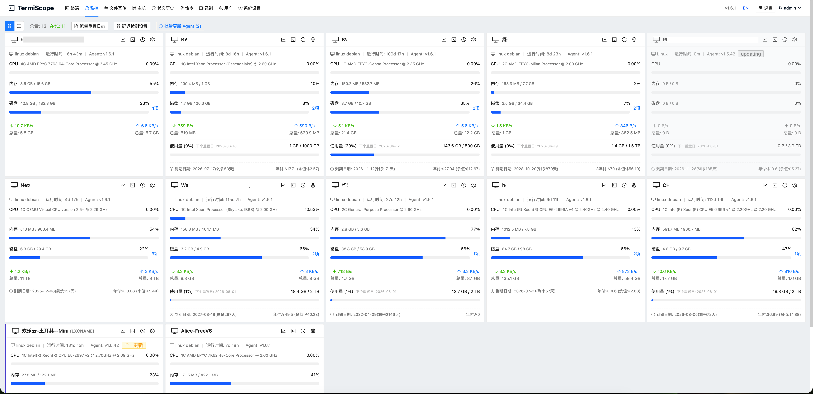

# TermiScope

TermiScope is a self-hosted server operations console built with Go and Vue 3. It combines browser-based SSH, SFTP file management, host monitoring, agent deployment, audit logs, user management, and secure release packaging in one deployable application.



## Highlights

- Web SSH terminal with multi-session navigation and host access controls.
- SFTP file manager with streaming upload, progress polling, cancellation cleanup, rename, copy, delete, directory sizing, and cross-host relay transfer.
- Lightweight monitoring agent for Linux, Windows, and macOS targets.
- Host metrics, traffic history, network latency tasks, and monitor event streams.
- User authentication with JWT, refresh-token cookies, CSRF protection, role checks, login history, session revocation, and TOTP 2FA.
- Encrypted host credentials and monitor secrets.
- Offline Linux amd64 package scripts and GitHub release automation.
- Docker Compose support for local or production-style container deployment.

## Tech Stack

| Layer | Technology |
| --- | --- |
| Backend | Go 1.25+, Gin, GORM, SQLite |
| Frontend | Vue 3, Vite, Pinia, Ant Design Vue |
| Terminal | xterm.js |
| Editor | Monaco Editor |
| Charts | ECharts |
| Tests | Go test, Node E2E runner, Docker test lab |

## Repository Layout

```text
cmd/server              Go server entrypoint
cmd/agent               Monitoring agent entrypoint
internal/               Backend packages, handlers, middleware, database, SSH, firewall
web/                    Vue 3 frontend application
e2e-tests/              Node-based end-to-end test runner
test-lab/               Dockerized SSH hosts used by E2E tests
configs/                Example configuration template
scripts/                Install, repair, release, and utility scripts
docs/                   Generated API documentation
images/                 README screenshots
```

## Requirements

- Go 1.25 or newer
- Node.js 20 or newer
- npm
- Docker and Docker Compose, when using container deployment or the E2E test lab

## Configuration

The real runtime configuration lives at `configs/config.yaml`. This file is intentionally ignored by Git because it may contain secrets.

Start from the template:

```bash
cp configs/config.example.yaml configs/config.yaml
```

For production, set strong secrets through environment variables or deployment configuration:

```bash
export TERMISCOPE_JWT_SECRET="replace-with-a-long-random-secret"
export TERMISCOPE_ENCRYPTION_KEY="replace-with-exactly-32-bytes-key"
```

Important configuration notes:

- `security.jwt_secret` signs access and refresh tokens.
- `security.encryption_key` encrypts stored SSH credentials and host secrets.
- `server.mode` should be `release` in production.
- `server.allowed_origins` must not contain `*` in release mode.
- `database.path` defaults to `./data/termiscope.db`.

## Development

Run backend tests:

```bash
go test ./...
```

Build backend binaries:

```bash
go build ./cmd/server
go build ./cmd/agent
```

Run the frontend:

```bash
cd web
npm install
npm run dev
```

Build the frontend:

```bash
cd web
npm run build
```

## Docker

Build and start TermiScope:

```bash
docker compose up -d --build
```

The Compose file maps the application to `http://127.0.0.1:3000` and injects container-safe defaults. For production, replace the secrets with deployment-specific values.

Check logs:

```bash
docker logs --tail=120 termiscope
```

## E2E Test Lab

The E2E suite uses three Dockerized SSH targets from `test-lab/`.

Start the SSH lab manually:

```bash
bash test-lab/manage.sh up
```

Run E2E against a containerized TermiScope server:

```bash
cd e2e-tests
E2E_SKIP_SERVER=1 \
E2E_BASE_URL=http://127.0.0.1:3000 \
E2E_SSH_HOST=host.docker.internal \
npm test
```

The full suite currently covers host ordering, streaming SFTP upload, upload cancellation, progress polling, cross-host transfer, grouped transfer tasks, and real-world mixed workflows.

## Release Packaging

GitHub release automation runs `build_release.sh`. Release packages include:

- `TermiScope` server binary
- `web/dist`
- bundled agent binaries
- install and repair scripts
- `configs/config.yaml.example`

The package never requires a committed `configs/config.yaml`.

Build all release artifacts locally:

```bash
bash build_release.sh
```

Build the Linux amd64 offline package only:

```bash
bash scripts/build_linux_amd64.sh
```

The Linux amd64 package is written to:

```text
release/termiscope-linux-amd64-<version>.tar.gz
```

Install on a target Linux server:

```bash
tar -xzf termiscope-linux-amd64-<version>.tar.gz
cd termiscope-linux-amd64-<version>
sudo ./scripts/install_local.sh -y
```

Existing installations preserve:

- `configs/config.yaml`
- `data/`
- `logs/`

## Security Practices

- Do not commit real `configs/config.yaml`, database files, logs, release artifacts, or private keys.
- Use environment variables or deployment secrets for JWT and encryption keys.
- Keep `configs/config.example.yaml` safe for distribution and free of production secrets.
- Run `go test ./...`, `npm audit`, and E2E tests before releasing security-sensitive changes.
- Review `docs/security-audit-2026-06-27.md` for the latest security audit notes when present.

## Useful Commands

```bash
# Go tests
go test ./...

# Frontend audit and build
cd web && npm audit && npm run build

# Containerized full E2E
docker compose up -d --build
cd e2e-tests && E2E_SKIP_SERVER=1 E2E_BASE_URL=http://127.0.0.1:3000 E2E_SSH_HOST=host.docker.internal npm test

# Release build
bash build_release.sh
```

## License

This project is distributed under the license included in [LICENSE](./LICENSE).
