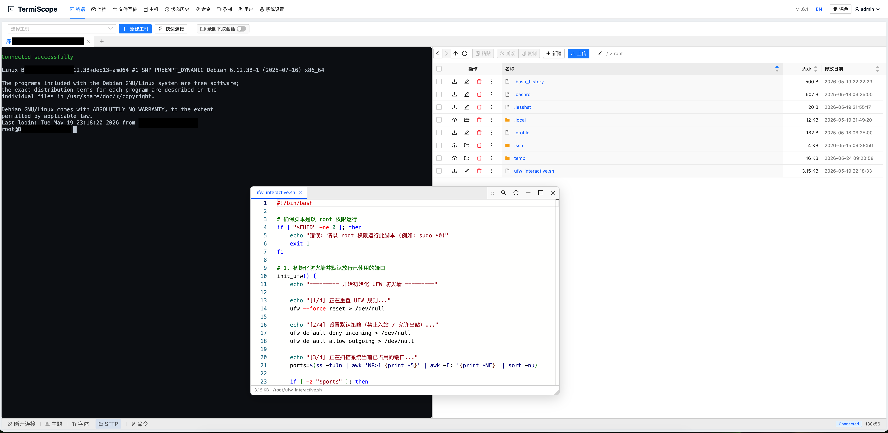
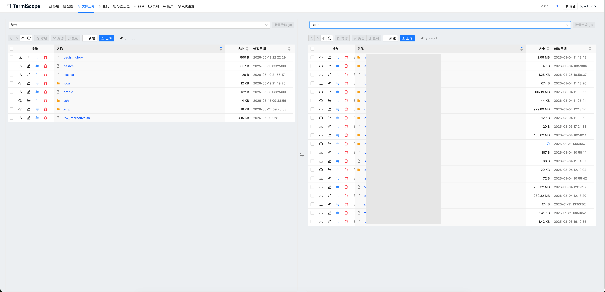
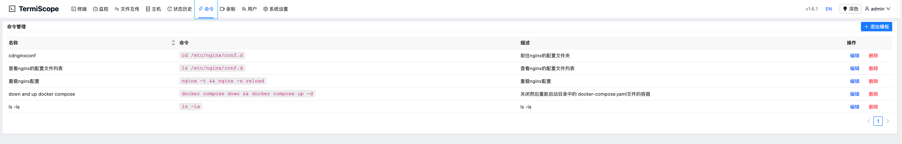

> **免责声明 / DISCLAIMER**
> 本项目 `README.md` 文档及相关核心代码结构说明均由 AI 自动分析生成。

<div align="center">
  
  <h1>TermiScope</h1>
  <p>
    <strong>严格、安全、高性能的现代化服务器统一管理与监控中枢</strong>
  </p>
  <p>
    
    
    
    
  </p>
</div>

---

## 📖 项目概述

TermiScope 是一款致力于解决多节点服务器运维复杂性的自托管综合管理平台。通过将 Web SSH 终端、可视化的文件管理（SFTP）、实时系统指标监控、以及严格的安全审计策略融合于一体，TermiScope 大幅提升了 DevOps 团队的操作效率和系统的安全性。

> **注：** 本系统专注于 Web 端和后端的全栈统筹整合，移动端（Mobile）相关功能不在当前文档与核心功能支持之列。

---

## 🖼️ 项目展示

<p align="center">
  
</p>

<p align="center"><em>实时监控看板 — 多主机 CPU、内存、磁盘与网络流量一览</em></p>

<p align="center">
  
</p>

<p align="center"><em>Web SSH 终端 — 集成 Monaco 编辑器，支持内联脚本编辑与 SFTP 文件浏览</em></p>

<p align="center">
  
</p>

<p align="center"><em>文件传输 — 双面板 SFTP，支持跨主机批量复制与拖拽上传</em></p>

<p align="center">
  
</p>

<p align="center"><em>命令管理 — 预置常用运维命令模板，一键下发至终端</em></p>

---

## ✨ 核心特性

### 🛡️ 严格的安全与合规
- **双重身份验证 (2FA)**：全面支持 TOTP (Google Authenticator, Authy 等) 二次验证，阻绝非法登录。
- **高强度加密**：所有主机凭据、密码、SSH 密钥等敏感数据均采用 AES-256-GCM 算法进行高强度静态加密。
- **动态审批流**：对于高危操作与关键设备的连接请求，系统内置灵活的审批工作流，需管理员授权后方可通行。
- **操作审计与回放**：内建会话录像功能，记录完整 SSH 交互历史，满足严格的安全审查需求。
- **防护机制**：后端对 Agent 通信以及敏感 API 接口实行严格的 Rate Limiting（频率限制），有效抵御恶意穷举和暴力破解。

### 🖥️ 现代化 Web 终端与文件管理
- **高性能 SSH 终端**：底层集成 `xterm.js`，具备极其流畅的输入反馈与标准控制台协议解析，支持快捷键映射与虚拟键盘。
- **集成式 SFTP**：提供与原生文件管理器体验一致的 Web SFTP 界面。支持批量文件操作、鼠标右键上下文菜单、拖拽上传、内联文件编辑和多媒体预览。
- **多会话标签页**：基于 Vue 的状态驻留（Keep-Alive）机制，支持同时管理多台主机，毫秒级无缝切换标签页而不丢失状态。

### 📊 全方位系统与网络监控
- **跨平台 Agent 守护**：提供适用于 Linux、Windows、macOS 等架构的轻量级探针（Agent），支持通过控制面板一键下发和拉起。
- **实时资源看板**：毫秒级采集 CPU、内存、磁盘 IO、网络吞吐量，通过 Echarts 进行直观的可视化图表渲染。
- **网络连通性探测**：内置 ICMP Ping 和 TCP Ping 工具，精准监测不同网络节点之间的延迟和丢包率。

---

## 🏗️ 架构与技术栈

本项目采用前后端分离的现代化技术架构，确保极致的响应速度与模块的独立性。

- **后端 (Backend)**：采用 `Golang 1.25+` 编写，以轻量级架构提供高性能的并发处理能力。基于 SQLite 提供便捷的嵌入式数据存储。
- **前端 (Frontend)**：基于 `Vue 3` (Composition API) + `Vite` 构建，组件库采用 `Ant Design Vue`。
- **核心依赖**：
  - 代码编辑器：`monaco-editor`
  - 终端渲染：`xterm`及其相关插件
  - 数据可视化：`echarts`
  - 国际化：`vue-i18n` (支持多语言环境)

---

## ⚙️ 系统配置规范

应用启动前，必须通过 `configs/config.yaml` 定义核心参数，所有安全配置需严格遵循以下规范：

| 模块 | 配置项 | 描述 | 安全建议 |
| --- | --- | --- | --- |
| **Security** | `security.jwt_secret` | JWT 签发密钥 | **必须**通过环境变量注入高强度随机字符串 |
| **Security** | `security.encryption_key` | AES 加密密钥 (32 字节) | **绝对禁止**将生产密钥提交至代码仓库 |
| **Server** | `server.mode` | 服务运行模式 (`debug`/`release`) | 生产环境请务必设定为 `release` 以屏蔽敏感堆栈 |
| **Database**| `database.path` | SQLite 存储路径 | 确保该目录拥有严格的操作系统读写权限控制 (如 `0600`) |

---

## 🚀 部署指南

### 方式一：一键安装脚本 (推荐 Linux / macOS)
如果您希望最快速地部署，可以直接运行我们的自动化安装脚本：
```bash
curl -fsSL https://raw.githubusercontent.com/ihxw/TermiScope/main/scripts/install.sh | bash
```

### 方式二：Docker 部署 (推荐)
如果您习惯使用容器化部署，可通过自带的 Docker Compose 文件一键拉起：
```bash
docker compose up -d
```

### 方式三：离线安装包手动部署（Linux amd64，推荐生产环境）

适用于将安装包拷贝到**其他 Linux 服务器**进行安装或升级。安装包为自包含离线包，内置二进制、前端静态资源及安装脚本。

#### 需要拷贝的文件

通常**只需一个文件**：

| 文件 | 说明 |
| --- | --- |
| `release/termiscope-linux-amd64-<版本>.tar.gz` | 离线安装包（含 `TermiScope`、`web/dist`、`scripts/` 等） |

安装包内已包含 `scripts/install_local.sh`、`scripts/install_from_archive.sh`、`scripts/repair_database.sh`、`scripts/uninstall.sh`，**无需**再单独拷贝仓库中的构建脚本。

> `scripts/install_wsl.sh`、`scripts/build_and_install_wsl.ps1` 仅用于本机 Windows + WSL 开发构建，目标服务器不需要。

#### 构建安装包（在开发机）

**Windows（交叉编译）：**

```powershell
.\scripts\build_linux_amd64.ps1
# 或：构建并安装到本机 WSL
.\scripts\build_and_install_wsl.ps1
```

**Linux / WSL：**

```bash
bash scripts/build_linux_amd64.sh
```

产物路径：`release/termiscope-linux-amd64-<版本>.tar.gz`

#### 在目标服务器上安装

**环境要求：** Linux x86_64、`systemd`、`sudo`/`root`；首次安装需已安装 `openssl`。

**方式 A — 解压后安装（推荐）**

```bash
# 1. 上传安装包（示例）
scp release/termiscope-linux-amd64-1.5.16.tar.gz user@your-server:/tmp/

# 2. 在目标服务器执行
cd /tmp
tar -xzf termiscope-linux-amd64-1.5.16.tar.gz
cd termiscope-linux-amd64-1.5.16
sudo ./scripts/install_local.sh -y
```

可选参数：

```bash
sudo ./scripts/install_local.sh --install-dir /opt/termiscope --port 3000 -y
```

**方式 B — 不解压整包，从 tar.gz 一键安装**

先将仓库中的 `scripts/install_from_archive.sh` 与 tar.gz 一并上传到服务器，然后：

```bash
sudo bash install_from_archive.sh /tmp/termiscope-linux-amd64-1.5.16.tar.gz -y
```

（也可使用安装包解压后自带的同路径脚本。）

#### 升级时的数据保护

使用 `install_local.sh` 升级时，若目标安装目录（默认 `/opt/termiscope`）中已存在以下内容，**不会被覆盖**：

| 路径 | 行为 |
| --- | --- |
| `configs/config.yaml` | 保留现有配置 |
| `data/`（含 `termiscope.db`） | 保留数据库 |
| `logs/` | 保留日志 |

以下内容会随版本更新：`TermiScope` 二进制、`web/dist`；`agents/` 为合并复制，不删除已有文件。

安装完成后服务由 systemd 管理（单元名 `termiscope`）：

```bash
sudo systemctl status termiscope
sudo systemctl restart termiscope
```

默认访问地址：`http://<服务器IP>:<config.yaml 中的 port>`（新装默认为 `3000`）。

数据库修复（如需）：

```bash
sudo systemctl stop termiscope
sudo /opt/termiscope/repair_database.sh --data-dir /opt/termiscope/data
sudo systemctl start termiscope
```

卸载：

```bash
sudo /opt/termiscope/uninstall.sh
```

---

### 方式四：手动下载二进制包直接运行

1. 前往 [GitHub Releases](https://github.com/ihxw/TermiScope/releases) 下载适合您操作系统的最新发行版压缩包。
2. 解压后，在终端赋予执行权限并直接运行：
   ```bash
   chmod +x TermiScope
   ./TermiScope
   ```
   *(Windows 用户请直接双击运行 `TermiScope.exe`)*

> 此方式不会自动配置 systemd 服务；生产环境建议使用上方的**方式三**离线安装包部署。

### 方式五：自行编译构建
为了确保产物的完整性或进行二次开发，您也可以使用项目自带的构建脚本自行编译：

```bash
# 克隆仓库
git clone https://github.com/ihxw/TermiScope.git
cd TermiScope

# Linux / macOS 环境编译发布版本
./build_release.sh

# Windows (PowerShell) 环境编译发布版本
./build_release.ps1
```
> *构建产物将自动输出至 `release/` 目录，进入该目录后运行二进制文件即可。服务默认监听于 `http://localhost:3000`。*

---

## 📖 API 接口规约

后端采用严格的 RESTful API 设计标准。在 `debug` 模式下，启动系统后可直接访问内置的 Swagger 文档查看所有可用接口：

```text
http://localhost:3000/swagger/index.html
```
*所有变更 API 接口行为的代码提交，必须同步运行 `swag init -g cmd/server/main.go --parseDependency` 更新接口契约。*

---

## 📄 授权协议

本项目严格遵循 [MIT License](LICENSE) 开源许可协议。保留所有权利，使用和分发请遵循相关法律与条款。

---
*注：本说明文档结构和文本通过 AI 基于项目最新代码库状态（Vue3 + Golang）自动化分析并生成。*
