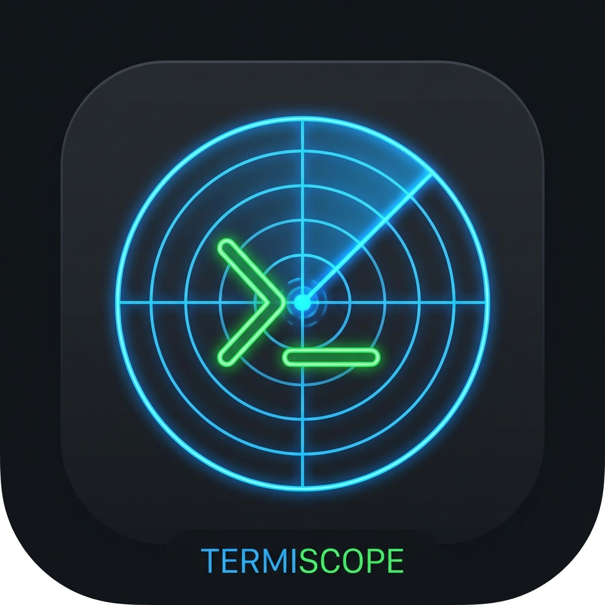

<div align="center">
  
  <h1>TermiScope</h1>
  <p>
    <strong>现代化、轻量级的服务器管理与监控平台</strong>
  </p>
  <p>
    <a href="https://go.dev/"></a>
    <a href="https://vuejs.org/"></a>
    <a href="https://hub.docker.com/"></a>
    
  </p>
</div>

TermiScope 是一个功能强大且支持自托管的服务器管理工具(**代码完全由AI编写,包括README.md**)，旨在简化 DevOps 工作流。它结合了全功能的 Web SSH 终端、全面的服务器状态监控、网络连通性监控和安全审计流程，支持多语言、多主题以及高度自定义。

---

## ✨ 功能特性

### 🖥️ Web 终端与 SFTP
- **全功能 SSH 客户端**：基于 `xterm.js`，支持所有标准 SSH 交互，提供与本地终端一致的体验。
- **自定义主题**：支持透明背景及 100+ 款类似 VS Code 的主题（Dracula, One Dark, Monokai 等）。
- **文件管理 (SFTP)**：支持 Zmodem 协议和内置可视化的 SFTP 浏览器，支持拖拽上传/下载。
- **凭据管理与自动填充**：安全存储 SSH 密码和密钥，支持编辑主机时自动填充已存密码。
- **终端界面优化**：自适应拉伸与动态调整展示区域，确保输出不被遮挡。

### 📊 服务器与网络监控
- **轻量级跨平台 Agent**：支持 Linux, Windows, macOS, 和 FreeBSD，一键下发和管理。
- **实时系统性能监控**：直观展示 CPU、内存、磁盘和网络 I/O 实时状态。
- **网络延迟监控**：支持 ICMP Ping 和 TCP Ping 协议的节点连通性检测，交互式图表展示历史数据和丢包率。
- **流量限制预警**：支持为主机配置月度流量配额（如 1TB）以及账单结算日，超限直观展示。

### 🛡️ 安全与审计管理
- **动态审批工作流应用**：支持可配置的动态安全审计与审批工作流管理，细致追踪每一个操作环节 (如安全工单审批)。
- **操作录像回放 (Session Recording)**：自动进行 SSH 终端会话录像，支持管理员事后审计和关键操作回放。
- **多语言与本地化 (i18n)**：全界面支持国际化（中英切换等），涵盖通知、仪表盘与配置组件。
- **全局时区设置**：支持自定义全局时区，统一日志与会话记录的时间戳展示。
- **身份验证与鉴权**：
  - 双重身份验证 (2FA / TOTP，例如 Google Authenticator, Authy)。
  - 基于角色 (Admin/User) 的访问权限控制。
  - 核心敏感配置与凭据 (如密码、私钥) 使用 AES-256 高强度加密。
  - API 与 Agent 通信频率限制 (Rate Limiting) 抵御暴力破解风险并在底层防御恶意流量。

---

## ⚙️ 系统配置项 (config.yaml)

启动系统前，可以通过修改 `configs/config.yaml` 灵活调整后端服务和安全策略：

### Server（服务器配置）
| 配置项 | 默认值 | 说明 |
| --- | --- | --- |
| `server.port` | `3000` | 后端服务监听绑定的端口号 |
| `server.mode` | `debug` | 运行模式：`debug` (输出更多日志) 或 `release` (生产环境精简日志) |
| `server.allowed_origins` | `["http://localhost:5173", ...]` | 允许的跨域请求源（CORS）。生产环境建议只保留实际域名，若前后端同源可清空 |
| `server.max_upload_size` | `1048576000` | 允许的最大文件上传尺寸（默认约 1000MB） |

### Database（数据库配置）
| 配置项 | 默认值 | 说明 |
| --- | --- | --- |
| `database.path` | `./data/termiscope.db` | 本地 SQLite 数据库文件存放路径 |

### Security（安全配置）
| 配置项 | 默认值 | 说明 |
| --- | --- | --- |
| `security.jwt_secret` | `""` | JWT Token 签名密钥。留空则首次启动自动生成。建议通过 `TERMISCOPE_JWT_SECRET` 环境变量注入 |
| `security.encryption_key` | `""` | 数据加密密钥（AES-256，需要正好 32 字节大小）。建议通过 `TERMISCOPE_ENCRYPTION_KEY` 环境变量注入 |
| `security.smtp_tls_skip_verify` | `false` | 是否跳过 SMTP TLS 验证。生产环境务必为 `false`，仅在测试环境下允许配置以覆盖安全验证 |
*(注：由于系统安全更新，登录频率限制等配置由代码底层防御层默认进行强制保护)*

### Log（日志配置）
| 配置项 | 默认值 | 说明 |
| --- | --- | --- |
| `log.level` | `info` | 记录日志的等级限制，如 `debug`, `info`, `warn`, `error` |
| `log.file` | `./logs/app.log` | 输出的日志文件绝对或相对路径 |

---

## 🚀 快速开始

### 方式一：一键安装脚本 (推荐 Linux/macOS)
```bash
curl -fsSL https://raw.githubusercontent.com/ihxw/TermiScope/main/scripts/install.sh | bash
```

### 方式二：手动运行二进制包
1. 从 [Releases 页面](https://github.com/ihxw/TermiScope/releases) 下载适合您操作系统的最新压缩包。
2. 解压文件并运行服务端核心程序：
   ```bash
   # Linux / macOS
   chmod +x TermiScope
   ./TermiScope
   
   # Windows
   ./server.exe
   ```
3. 在浏览器中访问 `http://localhost:3000`（或您修改的端口） 即可加载控制台。

---

## 🛠️ 开发与构建指南

### 依赖环境
- **Go 1.25+** (基于最新语言特性开发后端)
- **Node.js 20+** (依赖现代化的 Vite 和 Vue 3 生态开发前端)
- **PowerShell** (便于运行各端自动化脚本)

### 本地调试
安装并克隆项目到本地方向：
```bash
git clone https://github.com/ihxw/TermiScope.git
cd TermiScope
```

同时启动前后端热更新调试（支持 Windows PowerShell 环境）：
```powershell
./dev_run.ps1
```
*(脚本会自动启动多进程：Go API 绑定3000，Vue 前端 5173，并持续追踪修改动作)*

### 构建发布架构
一键构建完整的对应多平台架构的可执行文件：
```powershell
./build_release.ps1
```
构建成功后的压缩包、二进制文件将被统一储存在 `release/` 目录中。

---

## 📦 监控节点 (Agent) 部署

若希望在管理面板看到完整的服务器真实性能曲线图，需要在目标机器上安装 TermiScope Agent。提供如下方法：

**控制面板推送部署 (自动推荐)**：
1. 在 TermiScope 前端登录，点击 **Dashboard** -> **主机管理**。
2. 选择待监控的主机（可以勾选多台批量部署），点击界面的 **部署监控** 按钮。
3. 系统将复用配置好的 SSH 凭据自动化下发 Agent 安装包并将其设定为系统守护进程。

**手工推送部署**：
1. 下载适配目标平台架构的 `agent` 二进制执行文件。
2. 将文件推向服务器后运行注册指令并传递密钥参数：
   ```bash
   chmod +x agent
   ./agent -server http://YOUR_TERMISCOPE_IP:3000 -secret YOUR_APP_SECRET -id HOST_ID
   ```

---

## 📚 API 与开发接口文档
TermiScope 内置 Swagger API 在线交互文档服务。在 debug 开发模式下，可访问：
`http://localhost:3000/swagger/index.html`

如果后续在项目内部修改或扩展了 Go API 服务层面的接口参数逻辑与注释模型，请重新生成该文档结构规范：
```bash
swag init -g cmd/server/main.go --parseDependency
```

## 📝 许可协议与版权声明
本项目基于 [MIT License](LICENSE) 授权开源发布，受相应的开放源代码共识约束。详细声明和版权条文请参见源代码根目录下的 LICENSE 许可证文件。